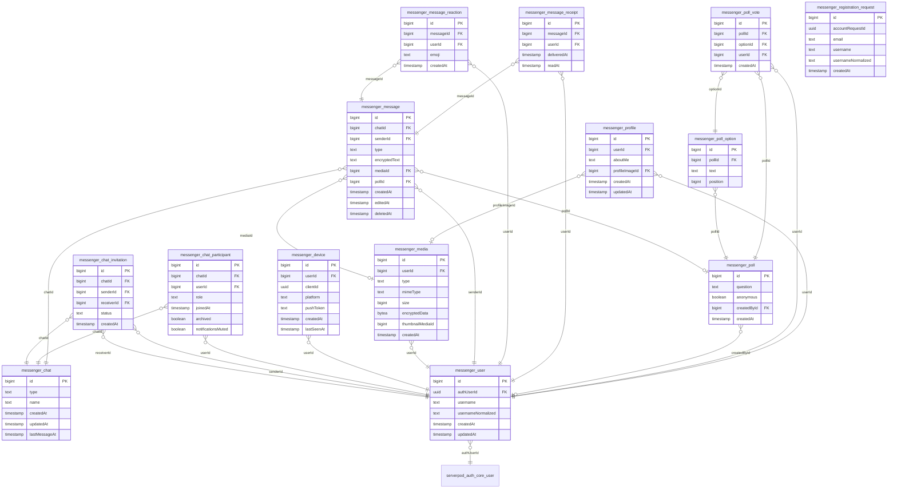

```mermaid
erDiagram

    messenger_chat {
        bigint id PK
        text type
        text name
        timestamp createdAt
        timestamp updatedAt
        timestamp lastMessageAt
    }

    messenger_chat_invitation {
        bigint id PK
        bigint chatId FK
        bigint senderId FK
        bigint receiverId FK
        text status
        timestamp createdAt
    }

    messenger_chat_participant {
        bigint id PK
        bigint chatId FK
        bigint userId FK
        text role
        timestamp joinedAt
        boolean archived
        boolean notificationsMuted
    }

    messenger_device {
        bigint id PK
        bigint userId FK
        uuid clientId
        text platform
        text pushToken
        timestamp createdAt
        timestamp lastSeenAt
    }

    messenger_media {
        bigint id PK
        bigint userId FK
        text type
        text mimeType
        bigint size
        bytea encryptedData
        bigint thumbnailMediaId
        timestamp createdAt
    }

    messenger_message {
        bigint id PK
        bigint chatId FK
        bigint senderId FK
        text type
        text encryptedText
        bigint mediaId FK
        bigint pollId FK
        timestamp createdAt
        timestamp editedAt
        timestamp deletedAt
    }

    messenger_message_reaction {
        bigint id PK
        bigint messageId FK
        bigint userId FK
        text emoji
        timestamp createdAt
    }

    messenger_message_receipt {
        bigint id PK
        bigint messageId FK
        bigint userId FK
        timestamp deliveredAt
        timestamp readAt
    }

    messenger_poll {
        bigint id PK
        text question
        boolean anonymous
        bigint createdById FK
        timestamp createdAt
    }

    messenger_poll_option {
        bigint id PK
        bigint pollId FK
        text text
        bigint position
    }

    messenger_poll_vote {
        bigint id PK
        bigint pollId FK
        bigint optionId FK
        bigint userId FK
        timestamp createdAt
    }

    messenger_profile {
        bigint id PK
        bigint userId FK
        text aboutMe
        bigint profileImageId FK
        timestamp createdAt
        timestamp updatedAt
    }

    messenger_registration_request {
        bigint id PK
        uuid accountRequestId
        text email
        text username
        text usernameNormalized
        timestamp createdAt
    }

    messenger_user {
        bigint id PK
        uuid authUserId FK
        text username
        text usernameNormalized
        timestamp createdAt
        timestamp updatedAt
    }

    messenger_chat_invitation }o--|| messenger_chat : chatId
    messenger_chat_invitation }o--|| messenger_user : receiverId
    messenger_chat_invitation }o--|| messenger_user : senderId
    messenger_chat_participant }o--|| messenger_chat : chatId
    messenger_chat_participant }o--|| messenger_user : userId
    messenger_device }o--|| messenger_user : userId
    messenger_media }o--|| messenger_user : userId
    messenger_message }o--o| messenger_media : mediaId
    messenger_message }o--o| messenger_poll : pollId
    messenger_message }o--|| messenger_chat : chatId
    messenger_message }o--|| messenger_user : senderId
    messenger_message_reaction }o--|| messenger_message : messageId
    messenger_message_reaction }o--|| messenger_user : userId
    messenger_message_receipt }o--|| messenger_message : messageId
    messenger_message_receipt }o--|| messenger_user : userId
    messenger_poll }o--o| messenger_user : createdById
    messenger_poll_option }o--|| messenger_poll : pollId
    messenger_poll_vote }o--|| messenger_poll : pollId
    messenger_poll_vote }o--|| messenger_poll_option : optionId
    messenger_poll_vote }o--|| messenger_user : userId
    messenger_profile }o--o| messenger_media : profileImageId
    messenger_profile }o--|| messenger_user : userId
    messenger_user }o--|| serverpod_auth_core_user : authUserId
```
